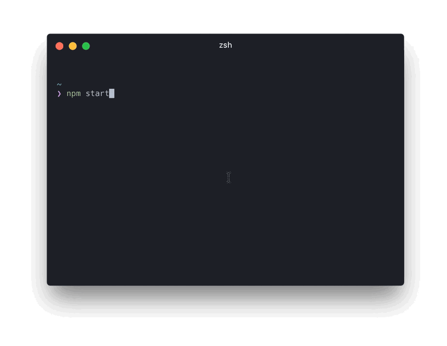

# Persona: Harald

Harald is an aspiring frontend developer eager to build sophisticated websites. He is co-working on a larger project – the technical setup has been performed by a senior and includes patternplate. He is expected and wants to get productive. Now.

* **Age**: 20 - 30
* **Work Experience**: 0 to 3 years
* **Occupation**: Frontend Developer
* **Responsibilities**: Development of Patterns, Quality of Patterns
* **Challenge**: Be productive

## Previous knowledge

*  Basic frontend development
*  Little knowledge of server side programming
*  Little knowledge of Node.js
*  **No** experience with pattern driven development
*  **No** experience with living styleguides

## Context

*  Started work on a patternplate project somebody else has setup
*  The project takes place in a professional environment
*  Harald is not the only person working on the project

## Motivation

*  Get started fast
*  Solve problems efficiently
*  Accelarate own development workflow

## Requirements

*  Detailed step by step guides for relevant topics
*  Concise and focused references
