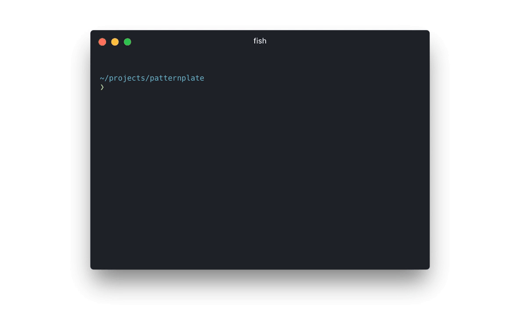

# Persona: Mika

Mika is a senior software developer. She tutors developers, teaches others and sets up projects on a regular basis after evaluating useful new technology and methodology. She solves problems for others and contributes actively to open source projects. She most likely takes on the role of a [Free Radical](https://sinnerschrader.github.io/free-radical-specification/) or comparable in her day-to-day work.

* **Age**: 25 - 40
* **Work Experience**: 3 to 5 years
* **Occupation**: Software Developer
* **Responsibilities**: Solving problems and blockers, teaching, technical advancement
* **Challenge**: Teach others, develop new solutions, contribute

## Previous knowledge

*  General purpose development
*  Contributing to OpenSource Software
*  Familiar with living styleguide concept
*  Limited experience with pattern driven development
*  **No** experience with development of patternplate transforms and plugins

## Context

*  Needs to solve some hard problem with patternplate
*  Teaches herself and others about development methodologies
*  Teaches herself and others about used tools
*  Wants to develop new transforms

## Motivation

*  Solve problems efficiently
*  Understand concepts to solve problems on her own
*  Accelarate development workflow of her team
*  Understand used technology better
*  Advance her team technically
*  Advance her team technologically

## Requirements

*  Explanations of concepts
*  Deep dive tutorials for harder problems
*  Concise and focused references
*  References for transform apis
*  Annotated code examples
