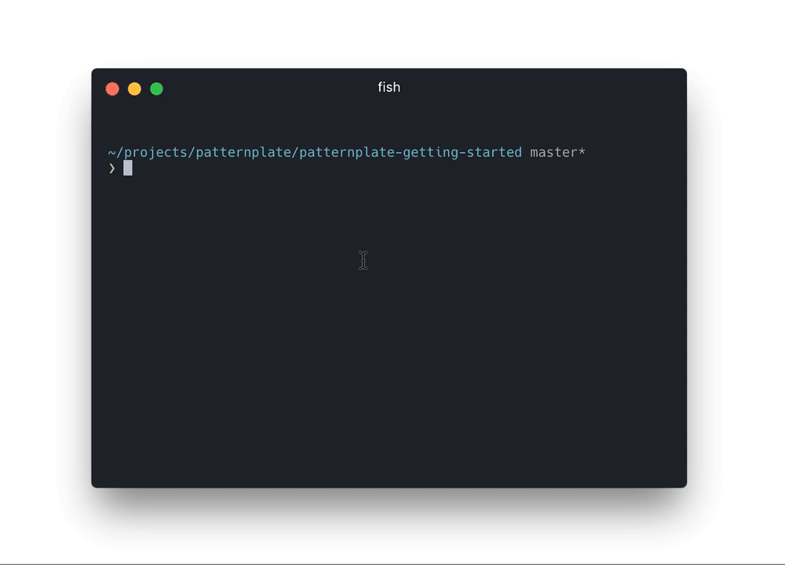

# Persona: Stephanie

Stephanie is an intermediate software developer. She regularily evaluates new tools, libraries and frameworks for usage in her company and helps with the setup of new projects.

* **Age**: 20 - 40
* **Work Experience**: 2 to 5 years
* **Occupation**: Software Developer
* **Responsibilities**: Evaluation of tools, development of patterns
* **Challenge**: Find good tools, be productive, teach others

## Previous knowledge

*  Frontend development
*  Limited server side programming
*  Familiar with living styleguide concept
*  **No** experience with pattern driven development

## Context

*  Evaluates patternplate for usage in her projects
*  Needs to solve some hard problem related to the pattern library she develops
*  Teaches herself about development methodologies
*  Teaches herself about used tools to gain better understanding

## Motivation

*  Solve problems efficiently
*  Understand concepts to solve problems on her own
*  Accelarate development workflow of her team
*  Understand used technology better

## Requirements

*  Explanations of concepts
*  Deep dive tutorials for harder problems
*  Concise and focused references
